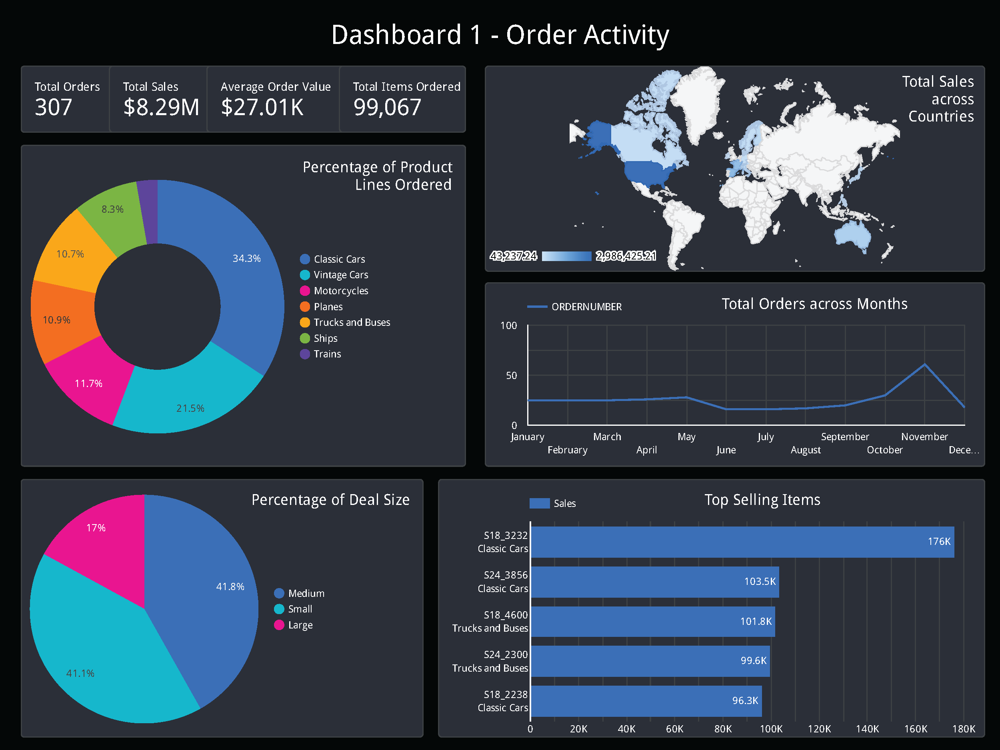
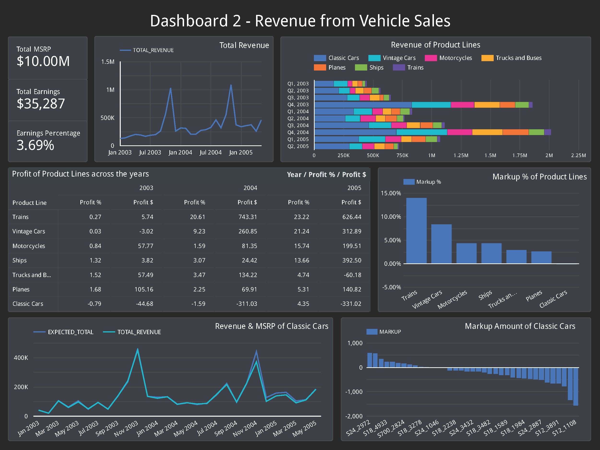
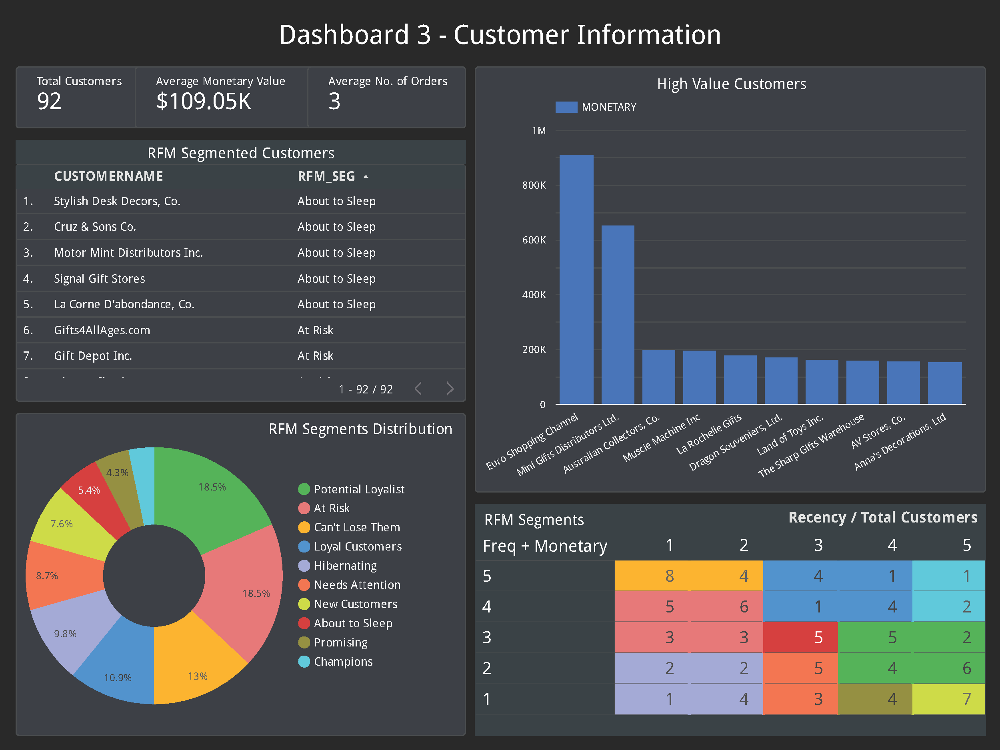

# SQL_Sales_Analytics
 Analysis of Sample Sales Data provided by Segura(2017) [Link](https://www.kaggle.com/datasets/kyanyoga/sample-sales-data)

 # What I Learned
 - Data Analysis using SQL
 - Create interactive dashboards using Google Looker Studio
 - Creating & Hosting database on Google Cloud SQL
 - Perform Customer Segmentation using RFM

## Dashboard 1 - Order Activity

## Dashboard 2 - Revenue Information

## Dashboard 3 - Customer Information & Segmentation

# References
- Peel, JA. (2023). What is RFM analysis?. Peel Insights. https://www.peelinsights.com/post/what-is-rfm-analysis
- Finer, A. (2023) Data Analyst Portfolio Project - SQL | Step-by-Step Guide From SQL Database to Interactive Dashboard. YouTube. https://youtu.be/0rB_memC-dA?feature=shared

