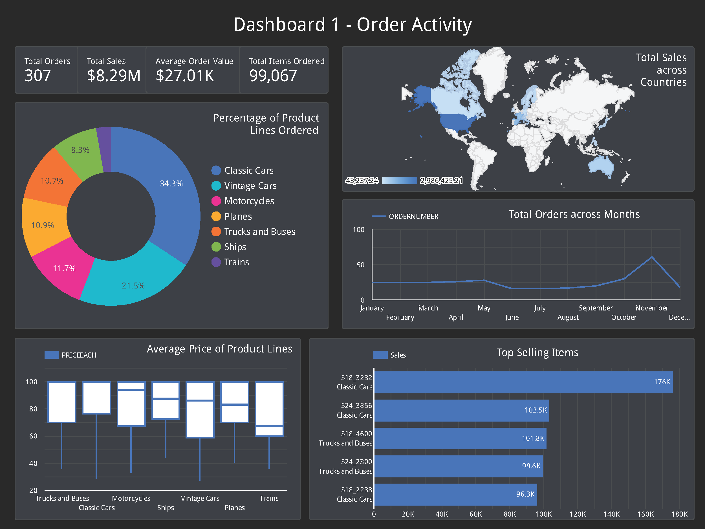

# SQL_Sales_Analytics
 Analysis of Sample Sales Data provided by Segura(2017) [Link](https://www.kaggle.com/datasets/kyanyoga/sample-sales-data)

 # What I Learned
 - Data Analysis using SQL
 - Create interactive dashboards using Google Looker Studio
 - Creating & Hosting database on Google Cloud SQL

## Dashboard 1

